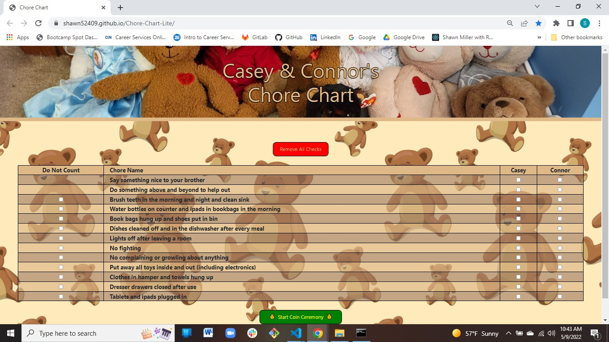
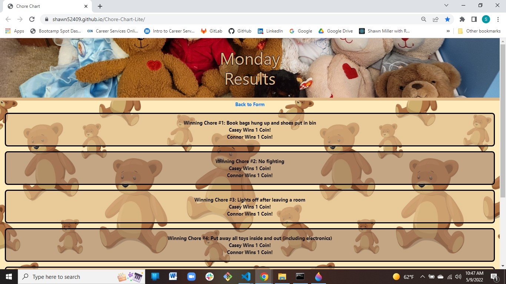

# Chore Chart created with React
Created by Shawn Miller

# Table of Contents
* [Description](#Description)
* [Installation](#Installation)
* [Technologies](#Technologies)
* [Appearance](#Appearance)
* [Bugs](#Bugs)
* [Contact-Info](#Contact-Info)

# Description
This app was created to keep track of my children's chores and daily tasks. At the end of the day my children will check which chores and tasks were completed. The app will then randomly chose a number of chores that will be selected to award the child for completing that chore or task.

# Installation
This app is deployed at: https://shawn52409.github.io/Chore-Chart-Lite/

Or

This app can be run locally by cloning the repo and running it in brower.

# Technologies Used
- JavaScript
- CSS
- HTML
- Bootstrap
- jQuery

# Appearance
Chore Chart Page

Results Page

# Known Bugs
No known bugs.

# Contact info
shawnsmm@gmail.com

github.com/Shawn52409

www.linkedin.com/in/shawn-miller-b44a36217